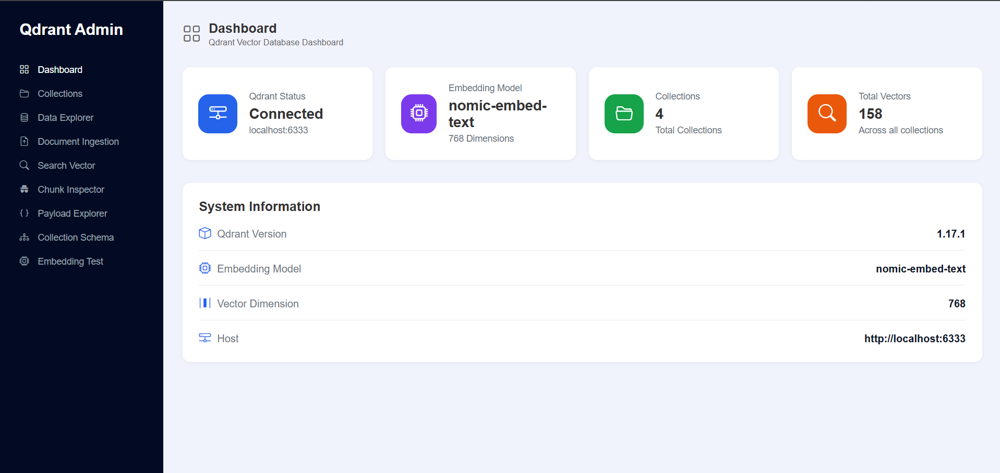
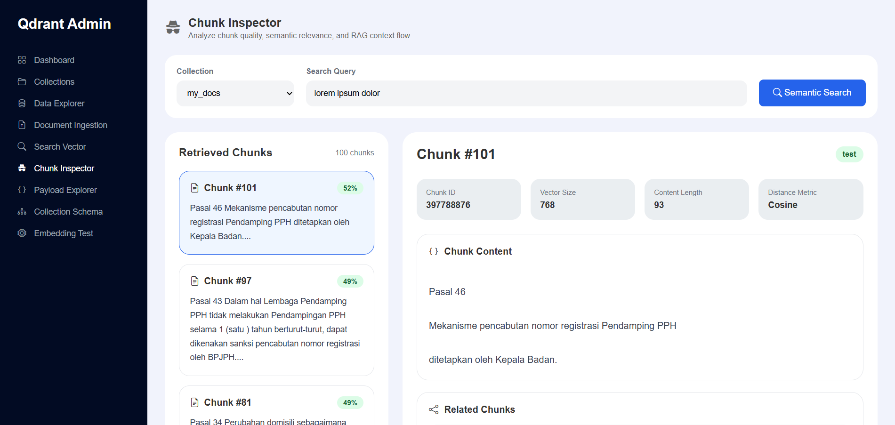
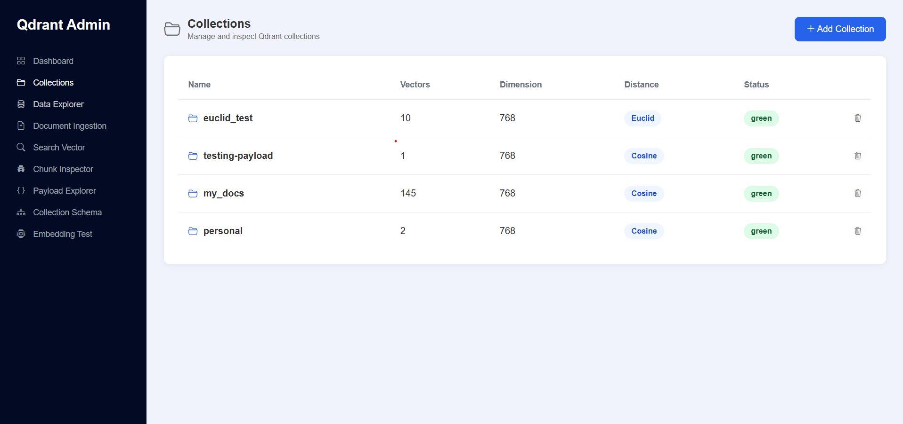
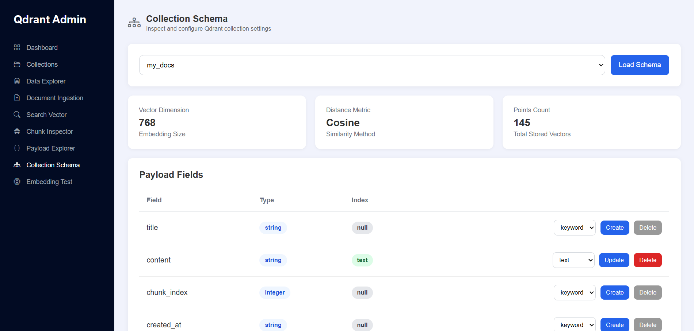
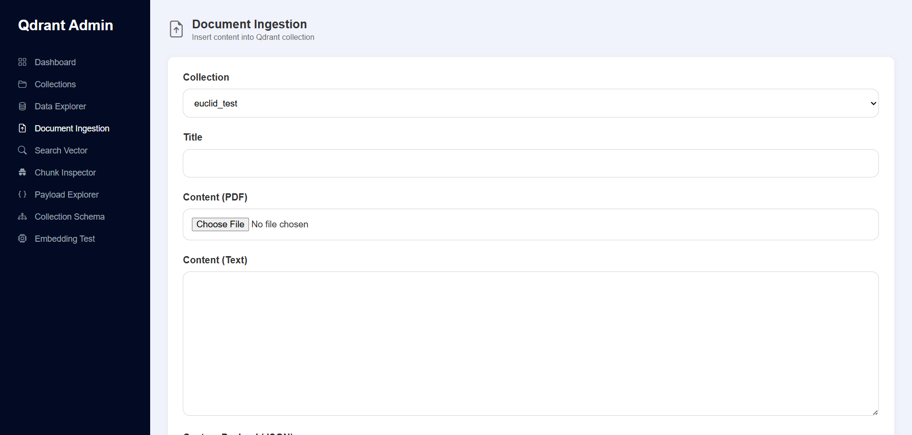
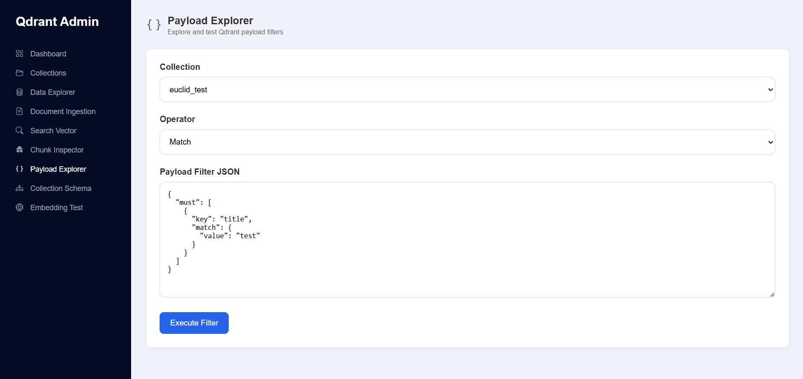

# Qdrant Admin By Zulkhaery

A lightweight unofficial Qdrant admin panel built with PHP.
Designed for local AI, RAG experimentation, and lightweight deployments.

A simple and developer-friendly interface for:

* Collection management
* Document ingestion
* Vector search
* Payload filtering
* Embedding testing
* Collection schema inspection
* Payload index management

---

## Features

### Dashboard

* Qdrant overview
* Collection statistics
* Vector count
* Embedding model information

### Collections

* View collections
* Create collections
* Configure vector dimension
* Configure distance metric

### Data Explorer

* Browse stored vectors
* Inspect payloads
* View vector dimension
* View raw vectors

### Chunk Inspector

* Semantic chunk retrieval
* Inspect chunk payload and content
* Analyze vector similarity scores
* Explore related chunks
* Debug RAG context retrieval flow

### Document Ingestion

* Upload PDF documents
* Manual text ingestion
* Automatic chunking
* Embedding generation
* Insert vectors into Qdrant

### Search Vector

* Semantic similarity search
* Vector-based retrieval
* Payload inspection
* Similarity scoring

### Payload Explorer

* Execute raw Qdrant payload filters
* Test payload filtering
* Inspect metadata queries

### Embedding Test

* Compare semantic similarity between texts
* Test embedding behavior
* Compare similarity methods
* Inspect generated vectors

### Collection Schema

* Inspect collection configuration
* View payload fields
* Create payload indexes
* Delete payload indexes

---

## Requirements

* PHP 8+
* Qdrant
* Ollama-compatible embedding model

---

## Installation

Clone repository:

```bash
git clone https://github.com/zulkhaery/qdrant-admin.git
```

Go to project:

```bash
cd qdrant-admin
```

Install dependencies:

```bash
composer install
```


## Environment

Create `.env`

```env
QDRANT_HOST=http://localhost:6333
OLLAMA_HOST=http://localhost:11434
EMBEDDING_MODEL=nomic-embed-text
```


## Run

Using PHP built-in server:

```bash
php -S localhost:8000 -t public
```

Open browser:

```text
http://localhost:8000
```


## Ollama Setup

Install model:

```bash
ollama pull nomic-embed-text
```

Run Ollama server:

```bash
ollama serve
```


## Qdrant Setup

Run Qdrant with Docker:

```bash
docker run -p 6333:6333 qdrant/qdrant
```


## Screenshots

<p align="center">
  
  &nbsp;&nbsp;
  
</p>
<p align="center">
  
  &nbsp;&nbsp;
 
</p>
<p align="center">
  
  &nbsp;&nbsp;
 
</p>